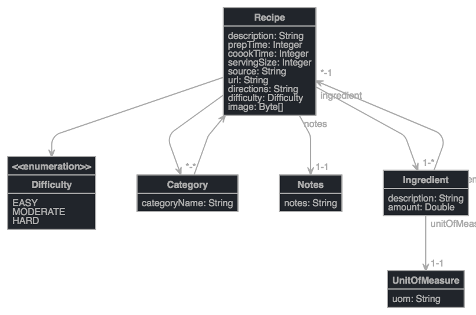

# Spring Boot Recipe Application

[](https://circleci.com/gh/saurabhpro/spring-guru-104-spring-mvc-recipies)

[](https://codecov.io/gh/saurabhpro/spring-guru-104-spring-mvc-recipies)
 
 ## Class Entity Modelling

[Click here to see the JDL Class Entity test](readme/jhipster-jdl.jh)

[Class Model Link](http://www.jhipster.tech/jdl-studio/#/view/entity%20Recipie%20%7B%0A%09description%20String%2C%0A%09prepTime%20Integer%2C%0A%20%20%20%20coookTime%20Integer%2C%0A%20%20%20%20servingSize%20Integer%2C%0A%20%20%20%20source%20String%2C%0A%20%20%20%20url%20String%2C%0A%20%20%20%20directions%20String%2C%0A%20%20%20%20difficulty%20Difficulty%2C%0A%20%20%20%20image%20Byte%5B%5D%0A%7D%0A%0Aentity%20Category%20%7B%0A%09categoryName%20String%0A%7D%0A%0Aentity%20Ingredient%20%7B%0A%09description%20String%2C%0A%09amount%20Double%0A%7D%0A%0Aentity%20UnitOfMeasure%20%7B%0A%09uom%20String%0A%7D%0A%0Aentity%20Notes%20%7B%0A%09notes%20String%0A%7D%0A%0Aenum%20Difficulty%20%7B%0A%09EASY%2C%20MODERATE%2C%20HARD%0A%7D%0A%0Arelationship%20OneToOne%20%7B%0A%09%20Ingredient%20to%20UnitOfMeasure%0A%7D%0A%0Arelationship%20ManyToMany%20%7B%0A%09Recipie%20to%20Category%0A%7D%0A%0Arelationship%20OneToMany%20%7B%0A%09Recipie%20to%20Ingredient%0A%7D%0A%0Arelationship%20OneToOne%20%7B%0A%09Recipie%20to%20Notes%0A%7D%0A)


## Difference Between @RequestParam and @PathVariable in Spring MVC

#### @RequestParam

**@RequestParam** annotation used for accessing the query parameter values from the request.

`http://localhost:8080/springmvc/hello/101?param1=10¶m2=20`

In the above URL request, the values for param1 and param2 can be accessed as below:
```java
public String getDetails(
	                        @RequestParam(value="param1", required=true) String param1,
                            @RequestParam(value="param2", required=false) String param2){
        //
}
```

The following are the list of parameters supported by the @RequestParam annotation:

    defaultValue – This is the default value as a fallback mechanism if request is not having the value or it is empty.
    name – Name of the parameter to bind
    required – Whether the parameter is mandatory or not. If it is true, failing to send that parameter will fail.
    value – This is an alias for the name attribute

#### @PathVariable

**@PathVariable** identifies the pattern that is used in the URI for the incoming request.

`http://localhost:8080/springmvc/hello/101?param1=10&param2=20`

The above URL request can be written in your Spring MVC as below:
```java
@RequestMapping("/hello/{id}")
	public String getDetails(@PathVariable(value="id") String id,
	                            @RequestParam(value="param1", required=true) String param1,
	                            @RequestParam(value="param2", required=false) String param2){
//
}
```

The @PathVariable annotation has only one attribute value for binding the request URI template. It is allowed to use the multiple @PathVariable annotation in the single method. But, ensure that no more than one method has the same pattern.

While developing RESTful Web Services, it will be useful to use this annotation for forming the more flexible URI (Also Read : REST API Best Practices).


@ManyToMany - use joinColumns & inverseJoinColumns (if needed) - dont use mappedBy
@OneToMany - mappedBy (so no column on the declaring side)
@ManyToOne - use @JoinColumn